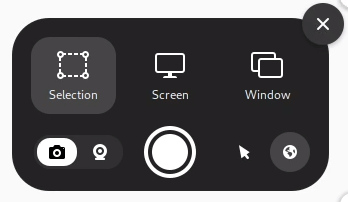
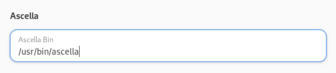
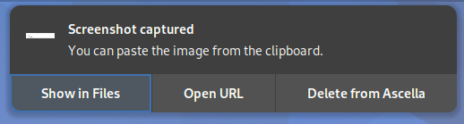

# [Ascella](https://ascella.host/) GNOME Extension
This is an extension for GNOME which integrates [Ascella](https://ascella.host/) into GNOME's screenshot tool.

## How to use
1. Setup and install [Ascella](https://ascella.host/config_wizard/)
2. Install and enable the GNOME extension
3. Start screenshotting!

## Screenshots
Toggle uploading to Ascella in the screenshot tool's preferences.

 

Change the location of the ascella binary in the extension's preferences.

Open or delete the uploaded screenshot from the notification.

## License
This project is licensed under the GPLv2 license. 

See the [LICENSE](LICENSE) file for more info.
